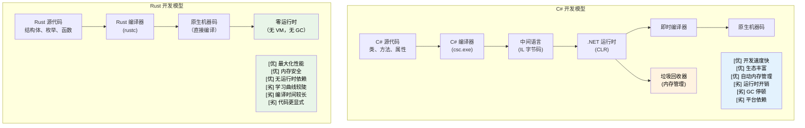

## 讲师介绍与总体方式

- 讲师介绍
    - 微软 SCHIE（芯片与云硬件基础设施工程）团队首席固件架构师
    - 行业资深人士，专注于安全、系统编程（固件、操作系统、虚拟机监控程序）、CPU 与平台架构以及 C++ 系统领域
    - 2017 年开始使用 Rust 编程（@AWS EC2），自此爱上了这门语言
- 本课程旨在尽可能具有互动性
    - 前提假设：你了解 C# 和 .NET 开发
    - 示例有意将 C# 概念映射到 Rust 等价物
    - **请随时提出任何问题**

---

## Rust 对 C# 开发者的价值

> **本节要点：** 为什么 Rust 对 C# 开发者很重要 — 托管代码与原生代码之间的性能差距，
> Rust 如何在编译期消除空引用异常和隐藏控制流，
> 以及 Rust 补充或替代 C# 的关键场景。
>
> **难度：** 🟢 入门

### 无运行时开销的高性能
```csharp
// C# - 开发效率高，但有运行时开销
public class DataProcessor
{
    private List<int> data = new List<int>();
    
    public void ProcessLargeDataset()
    {
        // 内存分配会触发 GC
        for (int i = 0; i < 10_000_000; i++)
        {
            data.Add(i * 2); // 造成 GC 压力
        }
        // 处理过程中存在不可预测的 GC 停顿
    }
}
// 运行时间：不稳定（因 GC 导致 50-200ms）
// 内存：~80MB（含 GC 开销）
// 可预测性：低（GC 停顿）
```

```rust
// Rust - 同等表达力，零运行时开销
struct DataProcessor {
    data: Vec<i32>,
}

impl DataProcessor {
    fn process_large_dataset(&mut self) {
        // 零成本抽象
        for i in 0..10_000_000 {
            self.data.push(i * 2); // 无 GC 压力
        }
        // 性能确定可预测
    }
}
// 运行时间：稳定（~30ms）
// 内存：~40MB（精确分配）
// 可预测性：高（无 GC）
```

### 无运行时检查的内存安全
```csharp
// C# - 运行时安全但有开销
public class RuntimeCheckedOperations
{
    public string? ProcessArray(int[] array)
    {
        // 每次访问都进行运行时边界检查
        if (array.Length > 0)
        {
            return array[0].ToString(); // 安全 — int 是值类型，永远不会为 null
        }
        return null; // 可空返回（C# 8+ 可空引用类型中的 string?）
    }
    
    public void ProcessConcurrently()
    {
        var list = new List<int>();
        
        // 可能发生数据竞争，需要仔细加锁
        Parallel.For(0, 1000, i =>
        {
            lock (list) // 运行时开销
            {
                list.Add(i);
            }
        });
    }
}
```

```rust
// Rust - 编译期安全，零运行时开销
struct SafeOperations;

impl SafeOperations {
    // 编译期空值安全，无运行时检查
    fn process_array(array: &[i32]) -> Option<String> {
        array.first().map(|x| x.to_string())
        // 不可能出现空引用
        // 在可证明安全时边界检查被优化掉
    }
    
    fn process_concurrently() {
        use std::sync::{Arc, Mutex};
        use std::thread;
        
        let data = Arc::new(Mutex::new(Vec::new()));
        
        // 数据竞争在编译期被阻止
        let handles: Vec<_> = (0..1000).map(|i| {
            let data = Arc::clone(&data);
            thread::spawn(move || {
                data.lock().unwrap().push(i);
            })
        }).collect();
        
        for handle in handles {
            handle.join().unwrap();
        }
    }
}
```

***

## Rust 所解决的常见 C# 痛点

### 1. 价值十亿美元的错误：空引用
```csharp
// C# - 空引用异常是运行时定时炸弹
public class UserService
{
    public string GetUserDisplayName(User user)
    {
        // 以下任何一处都可能抛出 NullReferenceException
        return user.Profile.DisplayName.ToUpper();
        //     ^^^^^ ^^^^^^^ ^^^^^^^^^^^ ^^^^^^^
        //     运行时可能为 null
    }
    
    // 可空引用类型（C# 8+）有所帮助，但 null 仍可能漏网
    public string GetDisplayName(User? user)
    {
        return user?.Profile?.DisplayName?.ToUpper() ?? "Unknown";
        // 这一行因为 ?. 和 ?? 是空安全的，
        // 但 NRT 是建议性的 — 编译器可以被 `!` 覆盖
    }
}
```

```rust
// Rust - 编译期保证空值安全
struct UserService;

impl UserService {
    fn get_user_display_name(user: &User) -> Option<String> {
        user.profile.as_ref()?
            .display_name.as_ref()
            .map(|name| name.to_uppercase())
        // 编译器强制你处理 None 的情况
        // 空指针异常不可能发生
    }
    
    fn get_display_name_safe(user: Option<&User>) -> String {
        user.and_then(|u| u.profile.as_ref())
            .and_then(|p| p.display_name.as_ref())
            .map(|name| name.to_uppercase())
            .unwrap_or_else(|| "Unknown".to_string())
        // 显式处理，没有意外
    }
}
```

### 2. 隐藏的异常与控制流
```csharp
// C# - 异常可以从任何地方抛出
public async Task<UserData> GetUserDataAsync(int userId)
{
    // 以下每一行都可能抛出不同的异常
    var user = await userRepository.GetAsync(userId);        // SqlException
    var permissions = await permissionService.GetAsync(user); // HttpRequestException  
    var preferences = await preferenceService.GetAsync(user); // TimeoutException
    
    return new UserData(user, permissions, preferences);
    // 调用者不知道要期待什么异常
}
```

```rust
// Rust - 所有错误在函数签名中显式声明
#[derive(Debug)]
enum UserDataError {
    DatabaseError(String),
    NetworkError(String),
    Timeout,
    UserNotFound(i32),
}

async fn get_user_data(user_id: i32) -> Result<UserData, UserDataError> {
    // 所有错误都是显式且经过处理的
    let user = user_repository.get(user_id).await
        .map_err(UserDataError::DatabaseError)?;
    
    let permissions = permission_service.get(&user).await
        .map_err(UserDataError::NetworkError)?;
    
    let preferences = preference_service.get(&user).await
        .map_err(|_| UserDataError::Timeout)?;
    
    Ok(UserData::new(user, permissions, preferences))
    // 调用者确切知道可能出现哪些错误
}
```

### 3. 正确性：类型系统作为证明引擎

Rust 的类型系统能在编译期捕获整类逻辑错误，而 C# 只能在运行时捕获——甚至根本无法捕获。

#### 代数数据类型与密封类变通方案
```csharp
// C# — 判别联合需要密封类样板代码。
// 编译器仅在没有 _ 兜底时才警告缺失的 case（CS8524）。
// 实际上，大多数 C# 代码使用 _ 作为默认分支，这会压制警告。
public abstract record Shape;
public sealed record Circle(double Radius)   : Shape;
public sealed record Rectangle(double W, double H) : Shape;
public sealed record Triangle(double A, double B, double C) : Shape;

public static double Area(Shape shape) => shape switch
{
    Circle c    => Math.PI * c.Radius * c.Radius,
    Rectangle r => r.W * r.H,
    // 忘了 Triangle？_ 兜底会压制任何编译器警告。
    _           => throw new ArgumentException("Unknown shape")
};
// 六个月后添加新变体 — _ 模式隐藏了缺失的 case。
// 没有编译器警告告诉你需要更新的 47 个 switch 表达式。
```

```rust
// Rust — 代数数据类型 + 穷举匹配 = 编译期证明
enum Shape {
    Circle { radius: f64 },
    Rectangle { w: f64, h: f64 },
    Triangle { a: f64, b: f64, c: f64 },
}

fn area(shape: &Shape) -> f64 {
    match shape {
        Shape::Circle { radius }    => std::f64::consts::PI * radius * radius,
        Shape::Rectangle { w, h }   => w * h,
        // 忘了 Triangle？错误：非穷举模式
        Shape::Triangle { a, b, c } => {
            let s = (a + b + c) / 2.0;
            (s * (s - a) * (s - b) * (s - c)).sqrt()
        }
    }
}
// 添加新变体 → 编译器告诉你每一处需要更新的 match。
```

#### 默认不可变与可选不可变
```csharp
// C# — 默认一切皆可变
public class Config
{
    public string Host { get; set; }   // 默认可变
    public int Port { get; set; }
}

// "readonly" 和 "record" 有所帮助，但无法阻止深层修改：
public record ServerConfig(string Host, int Port, List<string> AllowedOrigins);

var config = new ServerConfig("localhost", 8080, new List<string> { "*.example.com" });
// Record 是"不可变的"，但引用类型字段并非如此：
config.AllowedOrigins.Add("*.evil.com"); // 可以编译并发生修改！← 这是 bug
// 编译器不给出任何警告。
```

```rust
// Rust — 默认不可变，修改是显式且可见的
struct Config {
    host: String,
    port: u16,
    allowed_origins: Vec<String>,
}

let config = Config {
    host: "localhost".into(),
    port: 8080,
    allowed_origins: vec!["*.example.com".into()],
};

// config.allowed_origins.push("*.evil.com".into()); // 错误：无法以可变方式借用

// 修改需要显式选择：
let mut config = config;
config.allowed_origins.push("*.safe.com".into()); // 正确 — 显式可变

// 签名中的 "mut" 告诉每位读者："此函数会修改数据"
fn add_origin(config: &mut Config, origin: String) {
    config.allowed_origins.push(origin);
}
```

#### 函数式编程：一等公民与事后补丁
```csharp
// C# — FP 是后来添加的；LINQ 表达力强，但语言本身会与你对抗
public IEnumerable<Order> GetHighValueOrders(IEnumerable<Order> orders)
{
    return orders
        .Where(o => o.Total > 1000)   // Func<Order, bool> — 堆分配的委托
        .Select(o => new OrderSummary  // 匿名类型或额外的类
        {
            Id = o.Id,
            Total = o.Total
        })
        .OrderByDescending(o => o.Total);
    // 结果无穷举匹配
    // null 可以在管道任何位置悄然混入
    // 无法强制纯函数 — 任何 lambda 都可能有副作用
}
```

```rust
// Rust — FP 是一等公民
fn get_high_value_orders(orders: &[Order]) -> Vec<OrderSummary> {
    orders.iter()
        .filter(|o| o.total > 1000)      // 零成本闭包，无堆分配
        .map(|o| OrderSummary {           // 类型检查的结构体
            id: o.id,
            total: o.total,
        })
        .sorted_by(|a, b| b.total.cmp(&a.total)) // itertools
        .collect()
    // 管道中没有任何 null
    // 闭包被单态化 — 与手写循环相比零开销
    // 纯函数性有保证：&[Order] 意味着函数不能修改 orders
}
```

#### 继承：理论优雅，实践脆弱
```csharp
// C# — 脆弱基类问题
public class Animal
{
    public virtual string Speak() => "...";
    public void Greet() => Console.WriteLine($"I say: {Speak()}");
}

public class Dog : Animal
{
    public override string Speak() => "Woof!";
}

public class RobotDog : Dog
{
    // Greet() 调用哪个 Speak()？如果 Dog 改变了怎么办？
    // 接口 + 默认方法引发的菱形问题
    // 紧耦合：修改 Animal 可能悄无声息地破坏 RobotDog
}

// 常见的 C# 反模式：
// - 拥有 20 个虚方法的上帝基类
// - 无人能理解的深层继承层次（5+ 层）
// - 创建隐藏耦合的 "protected" 字段
// - 基类变更悄然改变派生类行为
```

```rust
// Rust — 组合优于继承，由语言强制执行
trait Speaker {
    fn speak(&self) -> &str;
}

trait Greeter: Speaker {
    fn greet(&self) {
        println!("I say: {}", self.speak());
    }
}

struct Dog;
impl Speaker for Dog {
    fn speak(&self) -> &str { "Woof!" }
}
impl Greeter for Dog {} // 使用默认的 greet()

struct RobotDog {
    voice: String, // 组合：拥有自己的数据
}
impl Speaker for RobotDog {
    fn speak(&self) -> &str { &self.voice }
}
impl Greeter for RobotDog {} // 清晰、显式的行为

// 没有脆弱基类问题 — 根本没有基类
// 没有隐藏耦合 — trait 是显式契约
// 没有菱形问题 — trait 一致性规则防止歧义
// 给 Speaker 添加方法？编译器告诉你每一处需要实现的地方。
```

> **核心洞见**：在 C# 中，正确性是一种纪律 — 你希望开发者
> 遵循约定、编写测试，并在代码评审中捕获边界情况。
> 在 Rust 中，正确性是**类型系统的属性** — 整类
> bug（空指针解引用、遗忘的变体、意外修改、
> 数据竞争）在结构上是不可能发生的。

***

### 4. 因 GC 导致的不可预测性能
```csharp
// C# - GC 可能在任何时候暂停
public class HighFrequencyTrader
{
    private List<Trade> trades = new List<Trade>();
    
    public void ProcessMarketData(MarketTick tick)
    {
        // 内存分配可能在最坏的时刻触发 GC
        var analysis = new MarketAnalysis(tick);
        trades.Add(new Trade(analysis.Signal, tick.Price));
        
        // GC 可能在关键市场时刻暂停于此
        // 停顿时长：1-100ms，取决于堆大小
    }
}
```

```rust
// Rust - 可预测的确定性性能
struct HighFrequencyTrader {
    trades: Vec<Trade>,
}

impl HighFrequencyTrader {
    fn process_market_data(&mut self, tick: MarketTick) {
        // 零分配，性能可预测
        let analysis = MarketAnalysis::from(tick);
        self.trades.push(Trade::new(analysis.signal(), tick.price));
        
        // 无 GC 停顿，一致的亚微秒延迟
        // 性能由类型系统保证
    }
}
```

***

## 何时选择 Rust 而非 C#

### ✅ 选择 Rust 的场景：
- **正确性至关重要**：状态机、协议实现、金融逻辑 — 遗漏一个 case 就是生产事故，而非测试失败
- **性能至关重要**：实时系统、高频交易、游戏引擎
- **内存用量很重要**：嵌入式系统、云成本、移动应用
- **需要可预测性**：医疗设备、汽车、金融系统
- **安全性至关重要**：密码学、网络安全、系统级代码
- **长时间运行的服务**：GC 停顿会造成问题的场景
- **资源受限环境**：IoT、边缘计算
- **系统编程**：CLI 工具、数据库、Web 服务器、操作系统

### ✅ 继续使用 C# 的场景：
- **快速应用开发**：业务应用、CRUD 应用
- **大型现有代码库**：迁移成本过高时
- **团队专业技能**：Rust 学习曲线不值得投入时
- **企业集成**：重度依赖 .NET Framework/Windows 时
- **GUI 应用**：WPF、WinUI、Blazor 生态
- **上市时间**：开发速度比性能更重要时

### 🔄 两者兼用（混合方案）：
- **性能关键组件用 Rust**：通过 P/Invoke 从 C# 调用
- **业务逻辑用 C#**：熟悉、高效的开发
- **渐进式迁移**：从新服务开始用 Rust

***

## 真实世界影响：企业为何选择 Rust

### Dropbox：存储基础设施
- **之前（Python）**：CPU 使用率高，内存开销大
- **之后（Rust）**：性能提升 10 倍，内存减少 50%
- **结果**：基础设施成本节省数百万美元

### Discord：语音/视频后端
- **之前（Go）**：GC 停顿导致音频中断
- **之后（Rust）**：一致的低延迟性能
- **结果**：更好的用户体验，更低的服务器成本

### 微软：Windows 组件
- **Windows 中的 Rust**：文件系统、网络栈组件
- **优势**：内存安全且无性能损失
- **影响**：更少的安全漏洞，相同的性能

### 这对 C# 开发者意味着什么：
1. **互补技能**：Rust 和 C# 解决不同的问题
2. **职业发展**：系统编程专业技能越来越有价值
3. **理解性能**：学习零成本抽象
4. **安全思维**：将所有权思维应用于任何语言
5. **云成本**：性能直接影响基础设施支出

***

## 语言哲学对比

### C# 哲学
- **效率优先**：丰富的工具链、完善的框架、"成功之坑"
- **托管运行时**：垃圾回收自动管理内存
- **企业导向**：强类型与反射，完整的标准库
- **面向对象**：以类、继承、接口为主要抽象

### Rust 哲学
- **无妥协的性能**：零成本抽象，无运行时开销
- **内存安全**：编译期保证防止崩溃和安全漏洞
- **系统编程**：直接访问硬件，同时提供高层抽象
- **函数式 + 系统**：默认不可变，基于所有权的资源管理



***

## 快速参考：Rust 与 C# 对比

| **概念** | **C#** | **Rust** | **核心差异** |
|-------------|--------|----------|-------------------|
| 内存管理 | 垃圾回收器 | 所有权系统 | 零成本、确定性清理 |
| 空引用 | 到处都是 `null` | `Option<T>` | 编译期空值安全 |
| 错误处理 | 异常 | `Result<T, E>` | 显式，无隐藏控制流 |
| 可变性 | 默认可变 | 默认不可变 | 显式选择可变 |
| 类型系统 | 引用/值类型 | 所有权类型 | 移动语义、借用 |
| 程序集 | GAC、应用域（.NET Framework）；并行安装（.NET 5+） | Crate | 静态链接，无运行时 |
| 命名空间 | `using System.IO` | `use std::fs` | 模块系统 |
| 接口 | `interface IFoo` | `trait Foo` | 默认实现 |
| 泛型 | `List<T>`（通过 `where` 可选约束） | `Vec<T>`（trait bounds 如 `T: Clone`） | 零成本抽象 |
| 线程 | 锁、async/await | 所有权 + Send/Sync | 数据竞争预防 |
| 性能 | JIT 编译 | AOT 编译 | 可预测，无 GC 停顿 |

***
