## 真正的不可变性 vs Record 的假象

> **你将学到：** 为什么 C# `record` 类型并非真正不可变（可变字段、反射绕过），
> Rust 如何在编译时强制实现真正的不可变性，以及何时使用内部可变性模式。
>
> **难度：** 🟡 中级

### C# Records - 不可变性剧场
```csharp
// C# records 看起来不可变，但有逃生出口
public record Person(string Name, int Age, List<string> Hobbies);

var person = new Person("John", 30, new List<string> { "reading" });

// 这些都"看起来"像是在创建新实例：
var older = person with { Age = 31 };  // 新记录
var renamed = person with { Name = "Jonathan" };  // 新记录

// 但引用类型仍然是可变的！
person.Hobbies.Add("gaming");  // 修改了原始值！
Console.WriteLine(older.Hobbies.Count);  // 2 - older person 也受到影响！
Console.WriteLine(renamed.Hobbies.Count); // 2 - renamed person 也受到影响！

// Init-only 属性仍可通过反射设置
typeof(Person).GetProperty("Age")?.SetValue(person, 25);

// 集合表达式有所帮助，但无法解决根本问题
public record BetterPerson(string Name, int Age, IReadOnlyList<string> Hobbies);

var betterPerson = new BetterPerson("Jane", 25, new List<string> { "painting" });
// 仍可通过强制转换修改：
((List<string>)betterPerson.Hobbies).Add("hacking the system");

// 即使是"不可变"集合也不是真正不可变的
using System.Collections.Immutable;
public record SafePerson(string Name, int Age, ImmutableList<string> Hobbies);
// 这更好，但需要规范约束且有性能开销
```

### Rust - 默认真正不可变
```rust
#[derive(Debug, Clone)]
struct Person {
    name: String,
    age: u32,
    hobbies: Vec<String>,
}

let person = Person {
    name: "John".to_string(),
    age: 30,
    hobbies: vec!["reading".to_string()],
};

// 这根本无法编译：
// person.age = 31;  // 错误：不能对不可变字段赋值
// person.hobbies.push("gaming".to_string());  // 错误：不能借用为可变

// 要修改，必须显式使用 'mut' 选择加入：
let mut older_person = person.clone();
older_person.age = 31;  // 现在很清楚这是修改操作

// 或使用函数式更新模式：
let renamed = Person {
    name: "Jonathan".to_string(),
    ..person  // 复制其他字段（应用移动语义）
};

// 原始值保证不变（直到被移动）：
println!("{:?}", person.hobbies);  // 始终是 ["reading"] - 不可变

// 使用高效不可变数据结构进行结构共享
use std::rc::Rc;

#[derive(Debug, Clone)]
struct EfficientPerson {
    name: String,
    age: u32,
    hobbies: Rc<Vec<String>>,  // 共享的不可变引用
}

// 创建新版本时高效共享数据
let person1 = EfficientPerson {
    name: "Alice".to_string(),
    age: 30,
    hobbies: Rc::new(vec!["reading".to_string(), "cycling".to_string()]),
};

let person2 = EfficientPerson {
    name: "Bob".to_string(),
    age: 25,
    hobbies: Rc::clone(&person1.hobbies),  // 共享引用，无需深拷贝
};
```



```mermaid
graph TD
    subgraph "C# Records - 浅层不可变性"
        CS_RECORD["record Person(...)"]
        CS_WITH["with 表达式"]
        CS_SHALLOW["⚠️ 仅顶层不可变"]
        CS_REF_MUT["❌ 引用类型仍可变"]
        CS_REFLECTION["❌ 反射可绕过"]
        CS_RUNTIME["❌ 运行时意外"]
        CS_DISCIPLINE["😓 需要团队规范"]
        
        CS_RECORD --> CS_WITH
        CS_WITH --> CS_SHALLOW
        CS_SHALLOW --> CS_REF_MUT
        CS_RECORD --> CS_REFLECTION
        CS_REF_MUT --> CS_RUNTIME
        CS_RUNTIME --> CS_DISCIPLINE
    end
    
    subgraph "Rust - 真正的不可变性"
        RUST_STRUCT["struct Person { ... }"]
        RUST_DEFAULT["✅ 默认不可变"]
        RUST_COMPILE["✅ 编译时强制执行"]
        RUST_MUT["🔒 需要显式 'mut'"]
        RUST_MOVE["🔄 移动语义"]
        RUST_ZERO["⚡ 零运行时开销"]
        RUST_SAFE["🛡️ 内存安全"]
        
        RUST_STRUCT --> RUST_DEFAULT
        RUST_DEFAULT --> RUST_COMPILE
        RUST_COMPILE --> RUST_MUT
        RUST_MUT --> RUST_MOVE
        RUST_MOVE --> RUST_ZERO
        RUST_ZERO --> RUST_SAFE
    end
    
    style CS_REF_MUT fill:#ffcdd2,color:#000
    style CS_REFLECTION fill:#ffcdd2,color:#000
    style CS_RUNTIME fill:#ffcdd2,color:#000
    style RUST_COMPILE fill:#c8e6c9,color:#000
    style RUST_ZERO fill:#c8e6c9,color:#000
    style RUST_SAFE fill:#c8e6c9,color:#000
```

---

## 练习

<details>
<summary><strong>🏋️ 练习：证明不可变性</strong>（点击展开）</summary>

一位 C# 同事声称他们的 `record` 是不可变的。将以下 C# 代码翻译为 Rust，并解释为什么 Rust 版本是真正不可变的：

```csharp
public record Config(string Host, int Port, List<string> AllowedOrigins);

var config = new Config("localhost", 8080, new List<string> { "example.com" });
// "不可变"记录……但是：
config.AllowedOrigins.Add("evil.com"); // 可以编译！List 是可变的。
```

1. 创建一个**真正**不可变的等价 Rust struct
2. 展示尝试修改 `allowed_origins` 是**编译错误**
3. 编写一个创建修改副本（新主机）而不进行修改的函数

<details>
<summary>🔑 解答</summary>

```rust
#[derive(Debug, Clone)]
struct Config {
    host: String,
    port: u16,
    allowed_origins: Vec<String>,
}

impl Config {
    fn with_host(&self, host: impl Into<String>) -> Self {
        Config {
            host: host.into(),
            ..self.clone()
        }
    }
}

fn main() {
    let config = Config {
        host: "localhost".into(),
        port: 8080,
        allowed_origins: vec!["example.com".into()],
    };

    // config.allowed_origins.push("evil.com".into());
    // ❌ 错误：不能将 `config.allowed_origins` 借用为可变

    let production = config.with_host("prod.example.com");
    println!("Dev: {:?}", config);       // 原始值未改变
    println!("Prod: {:?}", production);  // 具有不同主机的新副本
}
```

**关键洞察**：在 Rust 中，`let config = ...`（无 `mut`）使*整个值树*不可变——包括嵌套的 `Vec`。C# records 只使*引用*不可变，而不是内容。

</details>
</details>

***
