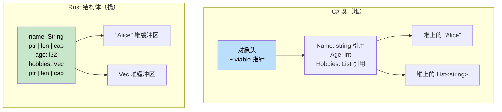

## 元组与解构

> **本章要点：** Rust 元组与 C# `ValueTuple` 的对比、数组和切片、结构体与类的区别、
> 用于领域建模的零成本类型安全的 newtype 模式，以及解构语法。
>
> **难度：** 🟢 初级

C# 从 C# 7 起支持 `ValueTuple`。Rust 的元组与其类似，但与语言的集成更加深入。

### C# 元组
```csharp
// C# ValueTuple（C# 7+）
var point = (10, 20);                         // (int, int)
var named = (X: 10, Y: 20);                   // 命名元素
Console.WriteLine($"{named.X}, {named.Y}");

// 作为返回类型的元组
public (int Quotient, int Remainder) Divide(int a, int b)
{
    return (a / b, a % b);
}

var (q, r) = Divide(10, 3);    // 解构
Console.WriteLine($"{q} remainder {r}");

// 丢弃符
var (_, remainder) = Divide(10, 3);  // 忽略商
```

### Rust 元组
```rust
// Rust 元组 — 默认不可变，无命名元素
let point = (10, 20);                // (i32, i32)
let point3d: (f64, f64, f64) = (1.0, 2.0, 3.0);

// 通过索引访问（从 0 开始）
println!("x={}, y={}", point.0, point.1);

// 作为返回类型的元组
fn divide(a: i32, b: i32) -> (i32, i32) {
    (a / b, a % b)
}

let (q, r) = divide(10, 3);       // 解构
println!("{q} remainder {r}");

// 使用 _ 丢弃
let (_, remainder) = divide(10, 3);

// 单元类型 () — "空元组"（类似 C# 的 void）
fn greet() {          // 隐式返回类型为 ()
    println!("hi");
}
```

### 主要区别

| 特性 | C# `ValueTuple` | Rust 元组 |
|---------|-----------------|------------|
| 命名元素 | `(int X, int Y)` | 不支持 — 请使用结构体 |
| 最大元数 | ~8（更多时使用嵌套） | 无限制（实际限制约 12） |
| 比较 | 自动支持 | 元素数 ≤ 12 时自动支持 |
| 用作字典键 | 是 | 是（若元素实现了 `Hash`） |
| 从函数返回 | 常见 | 常见 |
| 可变元素 | 始终可变 | 仅配合 `let mut` 使用 |

### 元组结构体（Newtype）
```rust
// 当普通元组描述性不足时，使用元组结构体：
struct Meters(f64);     // 单字段 "newtype" 包装器
struct Celsius(f64);
struct Fahrenheit(f64);

// 编译器将这些视为不同类型：
let distance = Meters(100.0);
let temp = Celsius(36.6);
// distance == temp;  // ❌ 错误：不能比较 Meters 和 Celsius

// Newtype 模式在编译时防止单位混淆 bug！
// 在 C# 中，要获得同等安全性需要定义完整的 class/struct。
```

```csharp
// C# 等效写法需要更多样板代码：
public readonly record struct Meters(double Value);
public readonly record struct Celsius(double Value);
// 两者不可互换，但 record 相比 Rust 的零成本 newtype 有额外开销
```

### 深入探讨 Newtype 模式：零成本的领域建模

Newtype 不仅仅用于防止单位混淆，它还是 Rust 将业务规则编码进类型系统的主要工具——
可以取代 C# 中常见的"守卫子句"和"验证类"模式。

#### C# 验证方式：运行时守卫
```csharp
// C# — 验证在运行时每次都会发生
public class UserService
{
    public User CreateUser(string email, int age)
    {
        if (string.IsNullOrWhiteSpace(email) || !email.Contains('@'))
            throw new ArgumentException("Invalid email");
        if (age < 0 || age > 150)
            throw new ArgumentException("Invalid age");

        return new User { Email = email, Age = age };
    }

    public void SendEmail(string email)
    {
        // 必须再次验证 — 还是相信调用方？
        if (!email.Contains('@')) throw new ArgumentException("Invalid email");
        // ...
    }
}
```

#### Rust Newtype 方式：编译时证明
```rust
/// 已验证的电子邮件地址 — 类型本身就是有效性的证明。
#[derive(Debug, Clone, PartialEq, Eq, Hash)]
pub struct Email(String);

impl Email {
    /// 创建 Email 的唯一途径 — 验证只在构造时发生一次。
    pub fn new(raw: &str) -> Result<Self, &'static str> {
        if raw.contains('@') && raw.len() > 3 {
            Ok(Email(raw.to_lowercase()))
        } else {
            Err("invalid email format")
        }
    }

    /// 安全访问内部值
    pub fn as_str(&self) -> &str { &self.0 }
}

/// 已验证的年龄 — 不可能创建无效值。
#[derive(Debug, Clone, Copy, PartialEq, Eq, PartialOrd, Ord)]
pub struct Age(u8);

impl Age {
    pub fn new(raw: u8) -> Result<Self, &'static str> {
        if raw <= 150 { Ok(Age(raw)) } else { Err("age out of range") }
    }
    pub fn value(&self) -> u8 { self.0 }
}

// 函数接受已证明的类型 — 无需重复验证！
fn create_user(email: Email, age: Age) -> User {
    // email 被类型不变量保证是有效的
    User { email, age }
}

fn send_email(to: &Email) {
    // 无需验证 — Email 类型证明了其有效性
    println!("Sending to: {}", to.as_str());
}
```

#### C# 开发者常用的 Newtype 场景

| C# 模式 | Rust Newtype | 防止的问题 |
|------------|-------------|------------------|
| `string` 表示 UserId、Email 等 | `struct UserId(Uuid)` | 将错误的字符串传给错误的参数 |
| `int` 表示端口、数量、索引 | `struct Port(u16)` | Port 和 Count 不可互换 |
| 到处写守卫子句 | 构造函数中一次性验证 | 重复验证、遗漏验证 |
| `decimal` 表示 USD、EUR | `struct Usd(Decimal)` | 意外地将 USD 与 EUR 相加 |
| `TimeSpan` 用于不同语义 | `struct Timeout(Duration)` | 将连接超时当作请求超时传入 |

```rust
// 零成本：newtype 编译后与内部类型生成相同的汇编代码。
// 以下 Rust 代码：
struct UserId(u64);
fn lookup(id: UserId) -> Option<User> { /* ... */ }

// 生成与下面完全相同的机器码：
fn lookup(id: u64) -> Option<User> { /* ... */ }
// 但在编译时具备完整的类型安全！
```

***

## 数组与切片

理解数组、切片和向量之间的区别至关重要。

### C# 数组
```csharp
// C# 数组
int[] numbers = new int[5];         // 固定大小，堆分配
int[] initialized = { 1, 2, 3, 4, 5 }; // 数组字面量

// 访问
numbers[0] = 10;
int first = numbers[0];

// 长度
int length = numbers.Length;

// 数组作为参数（引用类型）
void ProcessArray(int[] array)
{
    array[0] = 99;  // 修改原数组
}
```

### Rust 数组、切片和向量
```rust
// 1. 数组 - 固定大小，栈分配
let numbers: [i32; 5] = [1, 2, 3, 4, 5];  // 类型：[i32; 5]
let zeros = [0; 10];                       // 10 个零

// 访问
let first = numbers[0];
// numbers[0] = 10;  // ❌ 错误：数组默认不可变

let mut mut_array = [1, 2, 3, 4, 5];
mut_array[0] = 10;  // ✅ 配合 mut 使用

// 2. 切片 - 数组或向量的视图
let slice: &[i32] = &numbers[1..4];  // 元素 1、2、3
let all_slice: &[i32] = &numbers;    // 整个数组作为切片

// 3. 向量 - 动态大小，堆分配（前面已介绍）
let mut vec = vec![1, 2, 3, 4, 5];
vec.push(6);  // 可增长
```

### 切片作为函数参数
```csharp
// C# - 处理数组的方法
public void ProcessNumbers(int[] numbers)
{
    for (int i = 0; i < numbers.Length; i++)
    {
        Console.WriteLine(numbers[i]);
    }
}

// 仅适用于数组
ProcessNumbers(new int[] { 1, 2, 3 });
```

```rust
// Rust - 适用于任意序列的函数
fn process_numbers(numbers: &[i32]) {  // 切片参数
    for (i, num) in numbers.iter().enumerate() {
        println!("Index {}: {}", i, num);
    }
}

fn main() {
    let array = [1, 2, 3, 4, 5];
    let vec = vec![1, 2, 3, 4, 5];
    
    // 同一个函数对两者均适用！
    process_numbers(&array);      // 数组作为切片
    process_numbers(&vec);        // 向量作为切片
    process_numbers(&vec[1..4]);  // 部分切片
}
```

### 重温字符串切片（&str）
```rust
// String 和 &str 的关系
fn string_slice_example() {
    let owned = String::from("Hello, World!");
    let slice: &str = &owned[0..5];      // "Hello"
    let slice2: &str = &owned[7..];      // "World!"
    
    println!("{}", slice);   // "Hello"
    println!("{}", slice2);  // "World!"
    
    // 接受任意字符串类型的函数
    print_string("String literal");      // &str
    print_string(&owned);               // String 作为 &str
    print_string(slice);                // &str 切片
}

fn print_string(s: &str) {
    println!("{}", s);
}
```

***

## 结构体与类

Rust 的结构体与 C# 的类相似，但在所有权和方法方面有一些关键区别。



> **关键洞察**：C# 类始终通过引用存放在堆上。Rust 结构体默认存放在栈上——只有动态大小的数据（如 `String` 内容）才会进入堆。这消除了小型、频繁创建对象的 GC 开销。

### C# 类定义
```csharp
// C# 带属性和方法的类
public class Person
{
    public string Name { get; set; }
    public int Age { get; set; }
    public List<string> Hobbies { get; set; }
    
    public Person(string name, int age)
    {
        Name = name;
        Age = age;
        Hobbies = new List<string>();
    }
    
    public void AddHobby(string hobby)
    {
        Hobbies.Add(hobby);
    }
    
    public string GetInfo()
    {
        return $"{Name} is {Age} years old";
    }
}
```

### Rust 结构体定义
```rust
// Rust 带关联函数和方法的结构体
#[derive(Debug)]  // 自动实现 Debug trait
pub struct Person {
    pub name: String,    // 公共字段
    pub age: u32,        // 公共字段
    hobbies: Vec<String>, // 私有字段（无 pub）
}

impl Person {
    // 关联函数（类似静态方法）
    pub fn new(name: String, age: u32) -> Person {
        Person {
            name,
            age,
            hobbies: Vec::new(),
        }
    }
    
    // 方法（接受 &self、&mut self 或 self）
    pub fn add_hobby(&mut self, hobby: String) {
        self.hobbies.push(hobby);
    }
    
    // 不可变借用的方法
    pub fn get_info(&self) -> String {
        format!("{} is {} years old", self.name, self.age)
    }
    
    // 私有字段的 getter
    pub fn hobbies(&self) -> &Vec<String> {
        &self.hobbies
    }
}
```

### 创建与使用实例
```csharp
// C# 对象创建与使用
var person = new Person("Alice", 30);
person.AddHobby("Reading");
person.AddHobby("Swimming");

Console.WriteLine(person.GetInfo());
Console.WriteLine($"Hobbies: {string.Join(", ", person.Hobbies)}");

// 直接修改属性
person.Age = 31;
```

```rust
// Rust 结构体创建与使用
let mut person = Person::new("Alice".to_string(), 30);
person.add_hobby("Reading".to_string());
person.add_hobby("Swimming".to_string());

println!("{}", person.get_info());
println!("Hobbies: {:?}", person.hobbies());

// 直接修改公共字段
person.age = 31;

// 调试打印整个结构体
println!("{:?}", person);
```

### 结构体初始化模式
```csharp
// C# 对象初始化
var person = new Person("Bob", 25)
{
    Hobbies = new List<string> { "Gaming", "Coding" }
};

// 匿名类型
var anonymous = new { Name = "Charlie", Age = 35 };
```

```rust
// Rust 结构体初始化
let person = Person {
    name: "Bob".to_string(),
    age: 25,
    hobbies: vec!["Gaming".to_string(), "Coding".to_string()],
};

// 结构体更新语法（类似对象展开）
let older_person = Person {
    age: 26,
    ..person  // 使用 person 中的其余字段（会移动 person！）
};

// 元组结构体（类似匿名类型）
#[derive(Debug)]
struct Point(i32, i32);

let point = Point(10, 20);
println!("Point: ({}, {})", point.0, point.1);
```

***

## 方法与关联函数

理解方法和关联函数的区别是关键。

### C# 方法类型
```csharp
public class Calculator
{
    private int memory = 0;
    
    // 实例方法
    public int Add(int a, int b)
    {
        return a + b;
    }
    
    // 使用状态的实例方法
    public void StoreInMemory(int value)
    {
        memory = value;
    }
    
    // 静态方法
    public static int Multiply(int a, int b)
    {
        return a * b;
    }
    
    // 静态工厂方法
    public static Calculator CreateWithMemory(int initialMemory)
    {
        var calc = new Calculator();
        calc.memory = initialMemory;
        return calc;
    }
}
```

### Rust 方法类型
```rust
#[derive(Debug)]
pub struct Calculator {
    memory: i32,
}

impl Calculator {
    // 关联函数（类似静态方法）— 无 self 参数
    pub fn new() -> Calculator {
        Calculator { memory: 0 }
    }
    
    // 带参数的关联函数
    pub fn with_memory(initial_memory: i32) -> Calculator {
        Calculator { memory: initial_memory }
    }
    
    // 不可变借用方法（&self）
    pub fn add(&self, a: i32, b: i32) -> i32 {
        a + b
    }
    
    // 可变借用方法（&mut self）
    pub fn store_in_memory(&mut self, value: i32) {
        self.memory = value;
    }
    
    // 获取所有权的方法（self）
    pub fn into_memory(self) -> i32 {
        self.memory  // Calculator 被消耗
    }
    
    // getter 方法
    pub fn memory(&self) -> i32 {
        self.memory
    }
}

fn main() {
    // 关联函数使用 :: 调用
    let mut calc = Calculator::new();
    let calc2 = Calculator::with_memory(42);
    
    // 方法使用 . 调用
    let result = calc.add(5, 3);
    calc.store_in_memory(result);
    
    println!("Memory: {}", calc.memory());
    
    // 消耗型方法
    let memory_value = calc.into_memory();  // calc 不再可用
    println!("Final memory: {}", memory_value);
}
```

### 方法接收者类型详解
```rust
impl Person {
    // &self - 不可变借用（最常用）
    // 当只需要读取数据时使用
    pub fn get_name(&self) -> &str {
        &self.name
    }
    
    // &mut self - 可变借用
    // 当需要修改数据时使用
    pub fn set_name(&mut self, name: String) {
        self.name = name;
    }
    
    // self - 获取所有权（较少使用）
    // 当想消耗结构体时使用
    pub fn consume(self) -> String {
        self.name  // Person 被移动，不再可访问
    }
}

fn method_examples() {
    let mut person = Person::new("Alice".to_string(), 30);
    
    // 不可变借用
    let name = person.get_name();  // person 仍然可用
    println!("Name: {}", name);
    
    // 可变借用
    person.set_name("Alice Smith".to_string());  // person 仍然可用
    
    // 获取所有权
    let final_name = person.consume();  // person 不再可用
    println!("Final name: {}", final_name);
}
```

---

## 练习

<details>
<summary><strong>🏋️ 练习：切片滑动平均</strong>（点击展开）</summary>

**挑战**：编写一个函数，接受一个 `f64` 值的切片和窗口大小，返回滚动平均值的 `Vec<f64>`。
例如，`[1.0, 2.0, 3.0, 4.0, 5.0]` 窗口为 3 时 → `[2.0, 3.0, 4.0]`。

```rust
fn rolling_average(data: &[f64], window: usize) -> Vec<f64> {
    // 在此实现
    todo!()
}

fn main() {
    let data = vec![1.0, 2.0, 3.0, 4.0, 5.0];
    let avgs = rolling_average(&data, 3);
    println!("{avgs:?}"); // [2.0, 3.0, 4.0]
}
```

<details>
<summary>🔑 解答</summary>

```rust
fn rolling_average(data: &[f64], window: usize) -> Vec<f64> {
    data.windows(window)
        .map(|w| w.iter().sum::<f64>() / w.len() as f64)
        .collect()
}

fn main() {
    let data = vec![1.0, 2.0, 3.0, 4.0, 5.0];
    let avgs = rolling_average(&data, 3);
    assert_eq!(avgs, vec![2.0, 3.0, 4.0]);
    println!("{avgs:?}");
}
```

**要点**：切片内置了 `.windows()`、`.chunks()` 和 `.split()` 等强大方法，可替代手动索引运算。
在 C# 中，你会使用 `Enumerable.Range` 或 LINQ 的 `.Skip().Take()`。

</details>
</details>

<details>
<summary><strong>🏋️ 练习：迷你通讯录</strong>（点击展开）</summary>

使用结构体、枚举和方法构建一个小型通讯录：

1. 定义枚举 `PhoneType { Mobile, Home, Work }`
2. 定义结构体 `Contact`，包含 `name: String` 和 `phones: Vec<(PhoneType, String)>`
3. 实现 `Contact::new(name: impl Into<String>) -> Self`
4. 实现 `Contact::add_phone(&mut self, kind: PhoneType, number: impl Into<String>)`
5. 实现 `Contact::mobile_numbers(&self) -> Vec<&str>`，仅返回手机号码
6. 在 `main` 中创建联系人，添加两个电话，并打印手机号码

<details>
<summary>🔑 解答</summary>

```rust
#[derive(Debug, PartialEq)]
enum PhoneType { Mobile, Home, Work }

#[derive(Debug)]
struct Contact {
    name: String,
    phones: Vec<(PhoneType, String)>,
}

impl Contact {
    fn new(name: impl Into<String>) -> Self {
        Contact { name: name.into(), phones: Vec::new() }
    }

    fn add_phone(&mut self, kind: PhoneType, number: impl Into<String>) {
        self.phones.push((kind, number.into()));
    }

    fn mobile_numbers(&self) -> Vec<&str> {
        self.phones
            .iter()
            .filter(|(kind, _)| *kind == PhoneType::Mobile)
            .map(|(_, num)| num.as_str())
            .collect()
    }
}

fn main() {
    let mut alice = Contact::new("Alice");
    alice.add_phone(PhoneType::Mobile, "+1-555-0100");
    alice.add_phone(PhoneType::Work, "+1-555-0200");
    alice.add_phone(PhoneType::Mobile, "+1-555-0101");

    println!("{}'s mobile numbers: {:?}", alice.name, alice.mobile_numbers());
}
```

</details>
</details>

***
