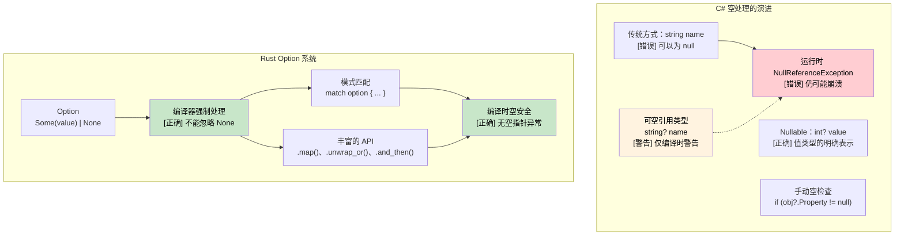

```mermaid
graph TD
    subgraph "C# 模式匹配的局限"
        CS_SWITCH["switch 表达式"]
        CS_WARNING["⚠️ 仅编译器警告"]
        CS_COMPILE["✅ 编译成功"]
        CS_RUNTIME["💥 运行时异常"]
        CS_DEPLOY["❌ 缺陷进入生产环境"]
        CS_SILENT["😰 枚举变更时的静默失败"]
        
        CS_SWITCH --> CS_WARNING
        CS_WARNING --> CS_COMPILE
        CS_COMPILE --> CS_RUNTIME
        CS_RUNTIME --> CS_DEPLOY
        CS_SWITCH --> CS_SILENT
    end
    
    subgraph "Rust 穷举匹配"
        RUST_MATCH["match 表达式"]
        RUST_ERROR["🛑 编译失败"]
        RUST_FIX["✅ 必须处理所有情况"]
        RUST_SAFE["✅ 零运行时意外"]
        RUST_EVOLUTION["🔄 枚举变更破坏编译"]
        RUST_REFACTOR["🛠️ 强制重构"]
        
        RUST_MATCH --> RUST_ERROR
        RUST_ERROR --> RUST_FIX
        RUST_FIX --> RUST_SAFE
        RUST_MATCH --> RUST_EVOLUTION
        RUST_EVOLUTION --> RUST_REFACTOR
    end
    
    style CS_RUNTIME fill:#ffcdd2,color:#000
    style CS_DEPLOY fill:#ffcdd2,color:#000
    style CS_SILENT fill:#ffcdd2,color:#000
    style RUST_SAFE fill:#c8e6c9,color:#000
    style RUST_REFACTOR fill:#c8e6c9,color:#000
```

## 穷举模式匹配：编译器保证 vs 运行时错误

> **本章要点：** 为什么 C# 的 `switch` 表达式会悄悄遗漏分支，而 Rust 的 `match` 在编译时就能捕获；
> `Option<T>` 与 `Nullable<T>` 的空安全对比，以及使用 `Result<T, E>` 的自定义错误类型。
>
> **难度：** 🟡 中级

### C# Switch 表达式——仍不完整
```csharp
// C# switch 表达式看起来穷举，但并不能保证
public enum HttpStatus { Ok, NotFound, ServerError, Unauthorized }

public string HandleResponse(HttpStatus status) => status switch
{
    HttpStatus.Ok => "Success",
    HttpStatus.NotFound => "Resource not found",
    HttpStatus.ServerError => "Internal error",
    // 缺少 Unauthorized 分支 — 编译时产生警告 CS8524，但不是错误！
    // 运行时：如果 status 为 Unauthorized，会抛出 SwitchExpressionException
};

// 即使有可空警告，这段代码也能编译：
public class User 
{
    public string Name { get; set; }
    public bool IsActive { get; set; }
}

public string ProcessUser(User? user) => user switch
{
    { IsActive: true } => $"Active: {user.Name}",
    { IsActive: false } => $"Inactive: {user.Name}",
    // 缺少 null 分支 — 编译器警告 CS8655，但不是错误！
    // 运行时：当 user 为 null 时，抛出 SwitchExpressionException
};
```

```csharp
// 后来添加枚举变体不会破坏已有 switch 的编译
public enum HttpStatus 
{ 
    Ok, 
    NotFound, 
    ServerError, 
    Unauthorized,
    Forbidden  // 添加这个只会产生额外的 CS8524 警告，不会破坏编译！
}
```

### Rust 模式匹配——真正的穷举性
```rust
#[derive(Debug)]
enum HttpStatus {
    Ok,
    NotFound, 
    ServerError,
    Unauthorized,
}

fn handle_response(status: HttpStatus) -> &'static str {
    match status {
        HttpStatus::Ok => "Success",
        HttpStatus::NotFound => "Resource not found", 
        HttpStatus::ServerError => "Internal error",
        HttpStatus::Unauthorized => "Authentication required",
        // 如果缺少任何分支，编译器会报错！
        // 这段代码字面上无法编译通过
    }
}

// 添加新变体会在所有使用处破坏编译
#[derive(Debug)]
enum HttpStatus {
    Ok,
    NotFound,
    ServerError, 
    Unauthorized,
    Forbidden,  // 添加这个会导致 handle_response() 编译失败
}
// 编译器强制你处理所有情况

// Option<T> 的模式匹配同样是穷举的
fn process_optional_value(value: Option<i32>) -> String {
    match value {
        Some(n) => format!("Got value: {}", n),
        None => "No value".to_string(),
        // 遗漏任何分支 = 编译错误
    }
}
```



***

## 空安全：`Nullable<T>` 与 `Option<T>`

### C# 空处理的演进
```csharp
// C# - 传统空处理（容易出错）
public class User
{
    public string Name { get; set; }  // 可以为 null！
    public string Email { get; set; } // 可以为 null！
}

public string GetUserDisplayName(User user)
{
    if (user?.Name != null)  // 空条件运算符
    {
        return user.Name;
    }
    return "Unknown User";
}
```

```csharp
// C# 8+ 可空引用类型
public class User
{
    public string Name { get; set; }    // 非空
    public string? Email { get; set; }  // 明确可空
}

// C# Nullable<T> 用于值类型
int? maybeNumber = GetNumber();
if (maybeNumber.HasValue)
{
    Console.WriteLine(maybeNumber.Value);
}
```

### Rust `Option<T>` 系统
```rust
// Rust - 使用 Option<T> 进行显式空处理
#[derive(Debug)]
pub struct User {
    name: String,           // 永远不为 null
    email: Option<String>,  // 明确为可选
}

impl User {
    pub fn get_display_name(&self) -> &str {
        &self.name  // 无需空检查 — 保证存在
    }
    
    pub fn get_email_or_default(&self) -> String {
        self.email
            .as_ref()
            .map(|e| e.clone())
            .unwrap_or_else(|| "no-email@example.com".to_string())
    }
}

// 模式匹配强制处理 None 情况
fn handle_optional_user(user: Option<User>) {
    match user {
        Some(u) => println!("User: {}", u.get_display_name()),
        None => println!("No user found"),
        // 如果不处理 None 情况，编译器会报错！
    }
}
```



***

```rust
#[derive(Debug)]
struct Point {
    x: i32,
    y: i32,
}

fn describe_point(point: Point) -> String {
    match point {
        Point { x: 0, y: 0 } => "origin".to_string(),
        Point { x: 0, y } => format!("on y-axis at y={}", y),
        Point { x, y: 0 } => format!("on x-axis at x={}", x),
        Point { x, y } if x == y => format!("on diagonal at ({}, {})", x, y),
        Point { x, y } => format!("point at ({}, {})", x, y),
    }
}
```

### Option 和 Result 类型
```csharp
// C# 可空引用类型（C# 8+）
public class PersonService
{
    private Dictionary<int, string> people = new();
    
    public string? FindPerson(int id)
    {
        return people.TryGetValue(id, out string? name) ? name : null;
    }
    
    public string GetPersonOrDefault(int id)
    {
        return FindPerson(id) ?? "Unknown";
    }
    
    // 基于异常的错误处理
    public void SavePerson(int id, string name)
    {
        if (string.IsNullOrEmpty(name))
            throw new ArgumentException("Name cannot be empty");
        
        people[id] = name;
    }
}
```

```rust
use std::collections::HashMap;

// Rust 使用 Option<T> 而非 null
struct PersonService {
    people: HashMap<i32, String>,
}

impl PersonService {
    fn new() -> Self {
        PersonService {
            people: HashMap::new(),
        }
    }
    
    // 返回 Option<T> — 没有 null！
    fn find_person(&self, id: i32) -> Option<&String> {
        self.people.get(&id)
    }
    
    // Option 上的模式匹配
    fn get_person_or_default(&self, id: i32) -> String {
        match self.find_person(id) {
            Some(name) => name.clone(),
            None => "Unknown".to_string(),
        }
    }
    
    // 使用 Option 方法（更函数式的风格）
    fn get_person_or_default_functional(&self, id: i32) -> String {
        self.find_person(id)
            .map(|name| name.clone())
            .unwrap_or_else(|| "Unknown".to_string())
    }
    
    // 使用 Result<T, E> 进行错误处理
    fn save_person(&mut self, id: i32, name: String) -> Result<(), String> {
        if name.is_empty() {
            return Err("Name cannot be empty".to_string());
        }
        
        self.people.insert(id, name);
        Ok(())
    }
    
    // 链式操作
    fn get_person_length(&self, id: i32) -> Option<usize> {
        self.find_person(id).map(|name| name.len())
    }
}

fn main() {
    let mut service = PersonService::new();
    
    // 处理 Result
    match service.save_person(1, "Alice".to_string()) {
        Ok(()) => println!("Person saved successfully"),
        Err(error) => println!("Error: {}", error),
    }
    
    // 处理 Option
    match service.find_person(1) {
        Some(name) => println!("Found: {}", name),
        None => println!("Person not found"),
    }
    
    // 函数式风格使用 Option
    let name_length = service.get_person_length(1)
        .unwrap_or(0);
    println!("Name length: {}", name_length);
    
    // 问号运算符用于提前返回
    fn try_operation(service: &mut PersonService) -> Result<String, String> {
        service.save_person(2, "Bob".to_string())?; // 出错时提前返回
        let name = service.find_person(2).ok_or("Person not found")?; // 将 Option 转为 Result
        Ok(format!("Hello, {}", name))
    }
    
    match try_operation(&mut service) {
        Ok(message) => println!("{}", message),
        Err(error) => println!("Operation failed: {}", error),
    }
}
```

### 自定义错误类型
```rust
// 定义自定义错误枚举
#[derive(Debug)]
enum PersonError {
    NotFound(i32),
    InvalidName(String),
    DatabaseError(String),
}

impl std::fmt::Display for PersonError {
    fn fmt(&self, f: &mut std::fmt::Formatter<'_>) -> std::fmt::Result {
        match self {
            PersonError::NotFound(id) => write!(f, "Person with ID {} not found", id),
            PersonError::InvalidName(name) => write!(f, "Invalid name: '{}'", name),
            PersonError::DatabaseError(msg) => write!(f, "Database error: {}", msg),
        }
    }
}

impl std::error::Error for PersonError {}

// 使用自定义错误增强 PersonService
impl PersonService {
    fn save_person_enhanced(&mut self, id: i32, name: String) -> Result<(), PersonError> {
        if name.is_empty() || name.len() > 50 {
            return Err(PersonError::InvalidName(name));
        }
        
        // 模拟可能失败的数据库操作
        if id < 0 {
            return Err(PersonError::DatabaseError("Negative IDs not allowed".to_string()));
        }
        
        self.people.insert(id, name);
        Ok(())
    }
    
    fn find_person_enhanced(&self, id: i32) -> Result<&String, PersonError> {
        self.people.get(&id).ok_or(PersonError::NotFound(id))
    }
}

fn demo_error_handling() {
    let mut service = PersonService::new();
    
    // 处理不同的错误类型
    match service.save_person_enhanced(-1, "Invalid".to_string()) {
        Ok(()) => println!("Success"),
        Err(PersonError::NotFound(id)) => println!("Not found: {}", id),
        Err(PersonError::InvalidName(name)) => println!("Invalid name: {}", name),
        Err(PersonError::DatabaseError(msg)) => println!("DB Error: {}", msg),
    }
}
```

---

## 练习

<details>
<summary><strong>🏋️ 练习：Option 组合子</strong>（点击展开）</summary>

使用 Rust 的 `Option` 组合子（`and_then`、`map`、`unwrap_or`）重写以下深度嵌套的 C# 空检查代码：

```csharp
string GetCityName(User? user)
{
    if (user != null)
        if (user.Address != null)
            if (user.Address.City != null)
                return user.Address.City.ToUpper();
    return "UNKNOWN";
}
```

使用这些 Rust 类型：
```rust
struct User { address: Option<Address> }
struct Address { city: Option<String> }
```

用**单个表达式**实现，不使用 `if let` 或 `match`。

<details>
<summary>�� 解答</summary>

```rust
struct User { address: Option<Address> }
struct Address { city: Option<String> }

fn get_city_name(user: Option<&User>) -> String {
    user.and_then(|u| u.address.as_ref())
        .and_then(|a| a.city.as_ref())
        .map(|c| c.to_uppercase())
        .unwrap_or_else(|| "UNKNOWN".to_string())
}

fn main() {
    let user = User {
        address: Some(Address { city: Some("seattle".to_string()) }),
    };
    assert_eq!(get_city_name(Some(&user)), "SEATTLE");
    assert_eq!(get_city_name(None), "UNKNOWN");

    let no_city = User { address: Some(Address { city: None }) };
    assert_eq!(get_city_name(Some(&no_city)), "UNKNOWN");
}
```

**关键洞察**：`and_then` 是 Rust 中 `Option` 的 `?.` 运算符。每步返回 `Option`，链在 `None` 时短路——
这与 C# 的空条件运算符 `?.` 完全一样，但显式且类型安全。

</details>
</details>

***
