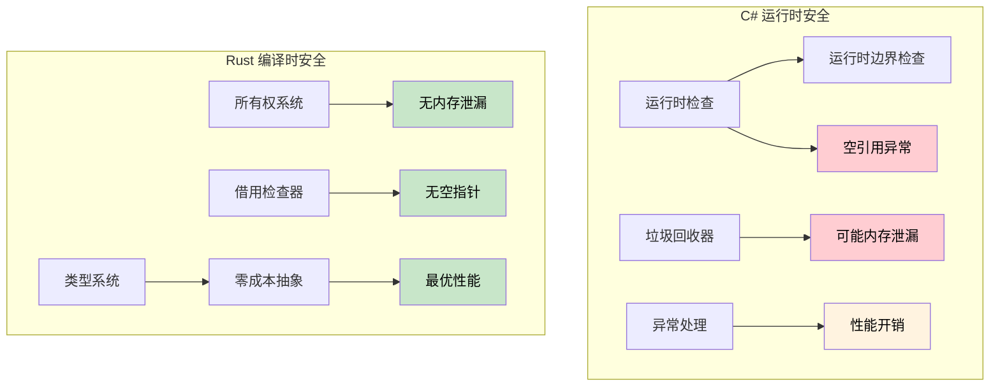

## 引用与指针

> **本章要点：** Rust 引用与 C# 指针及不安全上下文的对比、生命周期基础，
> 以及为什么编译时安全证明比 C# 的运行时检查（边界检查、空值守卫）更强大。
>
> **难度：** 🟡 中级

### C# 指针（不安全上下文）
```csharp
// C# 不安全指针（很少使用）
unsafe void UnsafeExample()
{
    int value = 42;
    int* ptr = &value;  // 指向值的指针
    *ptr = 100;         // 解引用并修改
    Console.WriteLine(value);  // 100
}
```

### Rust 引用（默认安全）
```rust
// Rust 引用（始终安全）
fn safe_example() {
    let mut value = 42;
    let ptr = &mut value;  // 可变引用
    *ptr = 100;           // 解引用并修改
    println!("{}", value); // 100
}

// 无需 "unsafe" 关键字 - 借用检查器确保安全
```

### C# 开发者的生命周期基础
```csharp
// C# - 可以返回可能变为无效的引用
public class LifetimeIssues
{
    public string GetFirstWord(string input)
    {
        return input.Split(' ')[0];  // 返回新字符串（安全）
    }
    
    public unsafe char* GetFirstChar(string input)
    {
        // 这很危险 - 返回指向托管内存的指针
        fixed (char* ptr = input)
            return ptr;  // ❌ 糟糕：方法结束后 ptr 变为无效
    }
}
```

```rust
// Rust - 生命周期检查防止悬空引用
fn get_first_word(input: &str) -> &str {
    input.split_whitespace().next().unwrap_or("")
    // ✅ 安全：返回的引用与输入具有相同的生命周期
}

fn invalid_reference() -> &str {
    let temp = String::from("hello");
    &temp  // ❌ 编译错误：temp 存活时间不够长
    // temp 在函数结束时会被销毁
}

fn valid_reference() -> String {
    let temp = String::from("hello");
    temp  // ✅ 可以：所有权转移给调用者
}
```

***

## 内存安全：运行时检查 vs 编译时证明

### C# - 运行时安全网
```csharp
// C# 依赖运行时检查和 GC
public class Buffer
{
    private byte[] data;
    
    public Buffer(int size)
    {
        data = new byte[size];
    }
    
    public void ProcessData(int index)
    {
        // 运行时边界检查
        if (index >= data.Length)
            throw new IndexOutOfRangeException();
            
        data[index] = 42;  // 安全，但在运行时检查
    }
    
    // 事件/静态引用仍可能造成内存泄漏
    public static event Action<string> GlobalEvent;
    
    public void Subscribe()
    {
        GlobalEvent += HandleEvent;  // 可能造成内存泄漏
        // 忘记取消订阅 - 对象无法被回收
    }
    
    private void HandleEvent(string message) { /* ... */ }
    
    // 空引用异常仍然可能发生
    public void ProcessUser(User user)
    {
        Console.WriteLine(user.Name.ToUpper());  // 如果 user.Name 为 null，会抛出 NullReferenceException
    }
    
    // 数组访问可能在运行时失败
    public int GetValue(int[] array, int index)
    {
        return array[index];  // 可能抛出 IndexOutOfRangeException
    }
}
```

### Rust - 编译时保证
```rust
struct Buffer {
    data: Vec<u8>,
}

impl Buffer {
    fn new(size: usize) -> Self {
        Buffer {
            data: vec![0; size],
        }
    }
    
    fn process_data(&mut self, index: usize) {
        // 当编译器能证明安全时，边界检查可以被优化掉
        if let Some(item) = self.data.get_mut(index) {
            *item = 42;  // 安全访问，在编译时证明
        }
        // 或者使用显式边界检查的索引访问：
        // self.data[index] = 42;  // 在调试模式下 panic，但内存安全
    }
    
    // 内存泄漏不可能 - 所有权系统防止它们
    fn process_with_closure<F>(&mut self, processor: F) 
    where F: FnOnce(&mut Vec<u8>)
    {
        processor(&mut self.data);
        // 当 processor 离开作用域时，它会自动清理
        // 无法创建悬空引用或内存泄漏
    }
    
    // 空指针解引用不可能 - 没有空指针！
    fn process_user(&self, user: &User) {
        println!("{}", user.name.to_uppercase());  // user.name 不能为 null
    }
    
    // 数组访问有边界检查或显式 unsafe
    fn get_value(array: &[i32], index: usize) -> Option<i32> {
        array.get(index).copied()  // 越界时返回 None
    }
    
    // 或者如果你知道自己在做什么，可以显式 unsafe：
    /// # Safety
    /// `index` 必须小于 `array.len()`。
    unsafe fn get_value_unchecked(array: &[i32], index: usize) -> i32 {
        *array.get_unchecked(index)  // 快速但必须手动证明边界
    }
}

struct User {
    name: String,  // Rust 中 String 不能为 null
}

// 所有权防止释放后使用
fn ownership_example() {
    let data = vec![1, 2, 3, 4, 5];
    let reference = &data[0];  // 借用 data
    
    // drop(data);  // 错误：借用期间不能 drop
    println!("{}", reference);  // 这是有保证的安全
}

// 借用防止数据竞争
fn borrowing_example(data: &mut Vec<i32>) {
    let first = &data[0];  // 不可变借用
    // data.push(6);  // 错误：不可变借用期间不能可变借用
    println!("{}", first);  // 保证无数据竞争
}
```



---

## 练习

<details>
<summary><strong>🏋️ 练习：发现安全漏洞</strong>（点击展开）</summary>

这段 C# 代码有一个隐蔽的安全漏洞。找出它，然后写出 Rust 等效代码，并解释为什么 Rust 版本**无法编译**：

```csharp
public List<int> GetEvenNumbers(List<int> numbers)
{
    var result = new List<int>();
    foreach (var n in numbers)
    {
        if (n % 2 == 0)
        {
            result.Add(n);
            numbers.Remove(n);  // 漏洞：在迭代时修改集合
        }
    }
    return result;
}
```

<details>
<summary>🔑 解答</summary>

**C# 漏洞**：在迭代 `numbers` 时修改它会在*运行时*抛出 `InvalidOperationException`。在代码审查中很容易遗漏。

```rust
fn get_even_numbers(numbers: &mut Vec<i32>) -> Vec<i32> {
    let mut result = Vec::new();
    for &n in numbers.iter() {
        if n % 2 == 0 {
            result.push(n);
            // numbers.retain(|&x| x != n);
            // ❌ 错误：不能可变借用 `*numbers`，因为
            //    它已经被不可变借用（通过迭代器）
        }
    }
    result
}

// 地道的 Rust：使用 partition 或 retain
fn get_even_numbers_idiomatic(numbers: &mut Vec<i32>) -> Vec<i32> {
    let evens: Vec<i32> = numbers.iter().copied().filter(|n| n % 2 == 0).collect();
    numbers.retain(|n| n % 2 != 0); // 迭代结束后删除偶数
    evens
}

fn main() {
    let mut nums = vec![1, 2, 3, 4, 5, 6];
    let evens = get_even_numbers_idiomatic(&mut nums);
    assert_eq!(evens, vec![2, 4, 6]);
    assert_eq!(nums, vec![1, 3, 5]);
}
```

**关键洞察**：Rust 的借用检查器在编译时就能防止整类"迭代时修改"的 bug。
C# 在运行时捕获这类问题；很多语言根本捕获不到。

</details>
</details>

***
