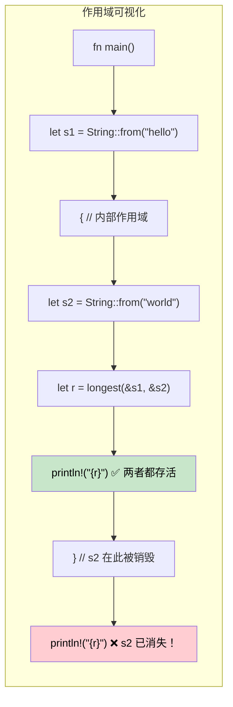

## 生命周期：告诉编译器引用存活多久

> **本章要点：** 生命周期存在的原因（没有 GC 意味着编译器需要证明）、生命周期标注语法、
> 省略规则、结构体生命周期、`'static` 生命周期，以及常见借用检查器错误及修复方法。
>
> **难度：** 🔴 高级

C# 开发者从不需要考虑引用的生命周期——垃圾回收器处理可达性。在 Rust 中，编译器需要*证明*每个引用在使用期间都是有效的。生命周期就是这个证明。

### 生命周期存在的原因
```rust
// 这无法编译 — 编译器无法证明返回的引用是有效的
fn longest(a: &str, b: &str) -> &str {
    if a.len() > b.len() { a } else { b }
}
// 错误：缺少生命周期说明符 — 编译器不知道
// 返回值借用自 `a` 还是 `b`
```

### 生命周期标注
```rust
// 生命周期 'a 表示："返回值至少与两个输入一样长"
fn longest<'a>(a: &'a str, b: &'a str) -> &'a str {
    if a.len() > b.len() { a } else { b }
}

fn main() {
    let result;
    let string1 = String::from("long string");
    {
        let string2 = String::from("xyz");
        result = longest(&string1, &string2);
        println!("Longest: {result}"); // ✅ 两个引用在此处仍然有效
    }
    // println!("{result}"); // ❌ 错误：string2 存活时间不够长
}
```

### C# 对比
```csharp
// C# — GC 在有引用指向对象时保持其存活
string Longest(string a, string b) => a.Length > b.Length ? a : b;

// 无生命周期问题 — GC 自动追踪可达性
// 但：GC 暂停、不可预测的内存使用、无编译时证明
```

### 生命周期省略规则

大多数情况下**不需要写生命周期标注**。编译器会自动应用三条规则：

| 规则 | 描述 | 示例 |
|------|-------------|---------|
| **规则 1** | 每个引用参数获得独立的生命周期 | `fn foo(x: &str, y: &str)` → `fn foo<'a, 'b>(x: &'a str, y: &'b str)` |
| **规则 2** | 若只有一个输入生命周期，它被赋给所有输出生命周期 | `fn first(s: &str) -> &str` → `fn first<'a>(s: &'a str) -> &'a str` |
| **规则 3** | 若有 `&self` 或 `&mut self`，其生命周期赋给所有输出 | `fn name(&self) -> &str` → 因 &self 自动处理 |

```rust
// 下面两者等价 — 编译器自动添加生命周期：
fn first_word(s: &str) -> &str { /* ... */ }           // 省略
fn first_word<'a>(s: &'a str) -> &'a str { /* ... */ } // 显式

// 但这个需要显式标注 — 两个输入，输出借用自哪个？
fn longest<'a>(a: &'a str, b: &'a str) -> &'a str { /* ... */ }
```

### 结构体生命周期
```rust
// 借用数据的结构体（而非拥有数据）
struct Excerpt<'a> {
    text: &'a str,  // 借用自某个 String，该 String 必须比此结构体存活更长
}

impl<'a> Excerpt<'a> {
    fn new(text: &'a str) -> Self {
        Excerpt { text }
    }

    fn first_sentence(&self) -> &str {
        self.text.split('.').next().unwrap_or(self.text)
    }
}

fn main() {
    let novel = String::from("Call me Ishmael. Some years ago...");
    let excerpt = Excerpt::new(&novel); // excerpt 借用自 novel
    println!("First sentence: {}", excerpt.first_sentence());
    // novel 必须在 excerpt 存在期间保持存活
}
```

```csharp
// C# 等效 — 无生命周期顾虑，但也无编译时保证
class Excerpt
{
    public string Text { get; }
    public Excerpt(string text) => Text = text;
    public string FirstSentence() => Text.Split('.')[0];
}
// 如果字符串在其他地方被修改怎么办？运行时意外。
```

### `'static` 生命周期
```rust
// 'static 表示"在整个程序期间存活"
let s: &'static str = "I'm a string literal"; // 存储在二进制中，始终有效

// 常见的 'static 场景：
// 1. 字符串字面量
// 2. 全局常量
// 3. Thread::spawn 需要 'static（线程可能比调用者存活更长）
std::thread::spawn(move || {
    // 发送到线程的闭包必须拥有数据或使用 'static 引用
    println!("{s}"); // 可以：&'static str
});

// 'static 不意味着"永生" — 它意味着"需要时可以永远存活"
let owned = String::from("hello");
// owned 不是 'static，但可以通过所有权转移发送到线程
```

### 常见借用检查器错误及修复

| 错误 | 原因 | 修复方法 |
|-------|-------|-----|
| `missing lifetime specifier` | 多个输入引用，输出不明确 | 添加 `<'a>` 将输出绑定到正确的输入 |
| `does not live long enough` | 引用比其指向的数据存活更长 | 扩展数据的作用域，或改为返回拥有所有权的数据 |
| `cannot borrow as mutable` | 不可变借用仍然活跃 | 在修改前使用不可变引用，或重构代码 |
| `cannot move out of borrowed content` | 试图获取借用数据的所有权 | 使用 `.clone()`，或重构以避免移动 |
| `lifetime may not live long enough` | 结构体借用比来源存活更长 | 确保来源数据的作用域涵盖结构体的使用 |

### 生命周期作用域可视化



### 多生命周期参数

有时引用来自不同来源，具有不同的生命周期：

```rust
// 两个独立的生命周期：返回值只借用自 'a，而非 'b
fn first_with_context<'a, 'b>(data: &'a str, _context: &'b str) -> &'a str {
    // 返回值只借用自 'data' — 'context' 可以有更短的生命周期
    data.split(',').next().unwrap_or(data)
}

fn main() {
    let data = String::from("alice,bob,charlie");
    let result;
    {
        let context = String::from("user lookup"); // 更短的生命周期
        result = first_with_context(&data, &context);
    } // context 被销毁 — 但 result 借用自 data，而非 context ✅
    println!("{result}");
}
```

```csharp
// C# — 无生命周期追踪意味着无法表达"借用自 A 而非 B"
string FirstWithContext(string data, string context) => data.Split(',')[0];
// 对 GC 语言没问题，但 Rust 无需 GC 就能证明安全
```

### 真实生命周期模式

**模式 1：返回引用的迭代器**
```rust
// 从输入中产生借用切片的解析器
struct CsvRow<'a> {
    fields: Vec<&'a str>,
}

fn parse_csv_line(line: &str) -> CsvRow<'_> {
    // '_ 告诉编译器"从输入推断生命周期"
    CsvRow {
        fields: line.split(',').collect(),
    }
}
```

**模式 2："不确定时返回拥有所有权的数据"**
```rust
// 当生命周期变复杂时，返回拥有所有权的数据是务实的选择
fn format_greeting(first: &str, last: &str) -> String {
    // 返回拥有所有权的 String — 无需生命周期标注
    format!("Hello, {first} {last}!")
}

// 只在以下情况借用：
// 1. 性能重要（避免分配）
// 2. 输入和输出生命周期的关系清晰
```

**模式 3：泛型上的生命周期约束**
```rust
// "T 必须至少与 'a 一样长"
fn store_reference<'a, T: 'a>(cache: &mut Vec<&'a T>, item: &'a T) {
    cache.push(item);
}

// trait 对象中常见：Box<dyn Display + 'a>
fn make_printer<'a>(text: &'a str) -> Box<dyn std::fmt::Display + 'a> {
    Box::new(text)
}
```

### 何时使用 `'static`

| 场景 | 使用 `'static`？ | 替代方案 |
|----------|:-----------:|-------------|
| 字符串字面量 | ✅ 是 — 始终是 `'static` | — |
| `thread::spawn` 闭包 | 通常是 — 线程可能比调用者存活更长 | 使用 `thread::scope` 处理借用数据 |
| 全局配置 | ✅ `lazy_static!` 或 `OnceLock` | 通过参数传递引用 |
| 长期存储的 trait 对象 | 通常是 — `Box<dyn Trait + 'static>` | 用 `'a` 参数化容器 |
| 临时借用 | ❌ 永远不要 — 过度约束 | 使用实际的生命周期 |

<details>
<summary><strong>🏋️ 练习：生命周期标注</strong>（点击展开）</summary>

**挑战**：添加正确的生命周期标注使代码能够编译：

```rust
struct Config {
    db_url: String,
    api_key: String,
}

// TODO: 添加生命周期标注
fn get_connection_info(config: &Config) -> (&str, &str) {
    (&config.db_url, &config.api_key)
}

// TODO: 此结构体借用自 Config — 添加生命周期参数
struct ConnectionInfo {
    db_url: &str,
    api_key: &str,
}
```

<details>
<summary>🔑 解答</summary>

```rust
struct Config {
    db_url: String,
    api_key: String,
}

// 规则 3 不适用（无 &self），规则 2 适用（一个输入 → 输出）
// 所以编译器自动处理 — 无需标注！
fn get_connection_info(config: &Config) -> (&str, &str) {
    (&config.db_url, &config.api_key)
}

// 结构体需要生命周期标注：
struct ConnectionInfo<'a> {
    db_url: &'a str,
    api_key: &'a str,
}

fn make_info<'a>(config: &'a Config) -> ConnectionInfo<'a> {
    ConnectionInfo {
        db_url: &config.db_url,
        api_key: &config.api_key,
    }
}
```

**关键要点**：生命周期省略通常让函数无需标注，但借用数据的结构体始终需要显式的 `<'a>`。

</details>
</details>

***
