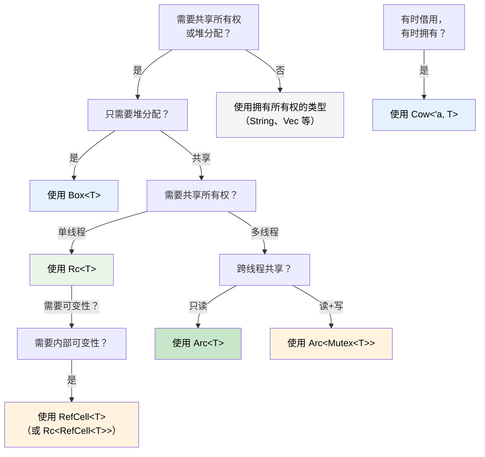

## 智能指针：当单一所有权不够用时

> **本章要点：** `Box<T>`、`Rc<T>`、`Arc<T>`、`Cell<T>`、`RefCell<T>` 和 `Cow<'a, T>` —
> 各自的使用时机、与 C# GC 管理引用的对比、作为 Rust 版 `IDisposable` 的 `Drop`、
> `Deref` 强制转换，以及选择正确智能指针的决策树。
>
> **难度：** 🔴 高级

在 C# 中，每个对象本质上都由 GC 进行引用计数。在 Rust 中，单一所有权是默认的——
但有时你需要共享所有权、堆分配或内部可变性。这就是智能指针的用武之地。

### Box&lt;T&gt; — 简单的堆分配
```rust
// 栈分配（Rust 默认）
let x = 42;           // 在栈上

// 使用 Box 进行堆分配
let y = Box::new(42); // 在堆上，类似 C# 的 `new int(42)`（装箱）
println!("{}", y);     // 自动解引用：打印 42

// 常见用途：递归类型（编译时无法知道大小）
#[derive(Debug)]
enum List {
    Cons(i32, Box<List>),  // Box 给出已知的指针大小
    Nil,
}

let list = List::Cons(1, Box::new(List::Cons(2, Box::new(List::Nil))));
```

```csharp
// C# — 所有东西已经在堆上了（引用类型）
// Box<T> 只在 Rust 中需要，因为栈是默认的
var list = new LinkedListNode<int>(1);  // 始终堆分配
```

### Rc&lt;T&gt; — 共享所有权（单线程）
```rust
use std::rc::Rc;

// 同一数据的多个所有者 — 类似多个 C# 引用
let shared = Rc::new(vec![1, 2, 3]);
let clone1 = Rc::clone(&shared); // 引用计数：2
let clone2 = Rc::clone(&shared); // 引用计数：3

println!("Count: {}", Rc::strong_count(&shared)); // 3
// 最后一个 Rc 离开作用域时数据被销毁

// 常见用途：共享配置、图节点、树结构
```

### Arc&lt;T&gt; — 共享所有权（线程安全）
```rust
use std::sync::Arc;
use std::thread;

// Arc = 原子引用计数 — 可安全跨线程共享
let data = Arc::new(vec![1, 2, 3]);

let handles: Vec<_> = (0..3).map(|i| {
    let data = Arc::clone(&data);
    thread::spawn(move || {
        println!("Thread {i}: {:?}", data);
    })
}).collect();

for h in handles { h.join().unwrap(); }
```

```csharp
// C# — 所有引用默认线程安全（GC 处理）
var data = new List<int> { 1, 2, 3 };
// 可自由跨线程共享（但修改仍然不安全！）
```

### Cell&lt;T&gt; 和 RefCell&lt;T&gt; — 内部可变性
```rust
use std::cell::RefCell;

// 有时你需要通过共享引用修改数据。
// RefCell 将借用检查从编译时移到运行时。
struct Logger {
    entries: RefCell<Vec<String>>,
}

impl Logger {
    fn new() -> Self {
        Logger { entries: RefCell::new(Vec::new()) }
    }

    fn log(&self, msg: &str) { // &self，而非 &mut self！
        self.entries.borrow_mut().push(msg.to_string());
    }

    fn dump(&self) {
        for entry in self.entries.borrow().iter() {
            println!("{entry}");
        }
    }
}
// ⚠️ 如果违反借用规则，RefCell 会在运行时 panic
// 谨慎使用 — 尽可能优先使用编译时检查
```

### Cow&lt;'a, str&gt; — 写时克隆
```rust
use std::borrow::Cow;

// 有时你有一个 &str，它*可能*需要变成 String
fn normalize(input: &str) -> Cow<'_, str> {
    if input.contains('\t') {
        // 只在需要修改时才分配
        Cow::Owned(input.replace('\t', "    "))
    } else {
        // 借用原始值 — 零分配
        Cow::Borrowed(input)
    }
}

let clean = normalize("hello");           // Cow::Borrowed — 无分配
let dirty = normalize("hello\tworld");    // Cow::Owned — 已分配
// 两者都可通过 Deref 作为 &str 使用
println!("{clean} / {dirty}");
```

### Drop：Rust 的 `IDisposable`

在 C# 中，`IDisposable` + `using` 处理资源清理。Rust 的等效是 `Drop` trait——但它是**自动的**，无需选择加入：

```csharp
// C# — 必须记得使用 'using' 或调用 Dispose()
using var file = File.OpenRead("data.bin");
// Dispose() 在作用域结束时调用

// 忘记 'using' 就是资源泄漏！
var file2 = File.OpenRead("data.bin");
// GC *最终*会终结，但时机不可预测
```

```rust
// Rust — Drop 在值离开作用域时自动运行
{
    let file = File::open("data.bin")?;
    // 使用 file...
}   // file.drop() 在此被确定性地调用 — 无需 'using'

// 自定义 Drop（类似实现 IDisposable）
struct TempFile {
    path: std::path::PathBuf,
}

impl Drop for TempFile {
    fn drop(&mut self) {
        // 保证在 TempFile 离开作用域时运行
        let _ = std::fs::remove_file(&self.path);
        println!("Cleaned up {:?}", self.path);
    }
}

fn main() {
    let tmp = TempFile { path: "scratch.tmp".into() };
    // ... 使用 tmp ...
}   // scratch.tmp 在此自动被删除
```

**与 C# 的关键区别：** 在 Rust 中，*每种*类型都可以有确定性的清理。你永远不会忘记 `using`，因为根本没有什么需要记住的——`Drop` 在所有者离开作用域时运行。这种模式被称为 **RAII**（资源获取即初始化）。

> **规则**：如果你的类型持有资源（文件句柄、网络连接、锁守卫、临时文件），就实现 `Drop`。所有权系统保证它恰好运行一次。

### Deref 强制转换：自动解包智能指针

Rust 在调用方法或将智能指针传递给函数时会自动"解包"它们。这被称为 **Deref 强制转换**：

```rust
let boxed: Box<String> = Box::new(String::from("hello"));

// Deref 强制转换链：Box<String> → String → str
println!("Length: {}", boxed.len());   // 调用 str::len() — 自动解引用！

fn greet(name: &str) {
    println!("Hello, {name}");
}

let s = String::from("Alice");
greet(&s);       // &String → &str，通过 Deref 强制转换
greet(&boxed);   // &Box<String> → &String → &str — 两层！
```

```csharp
// C# 没有等效机制 — 你需要显式转换或 .ToString()
// 最接近的：隐式转换运算符，但需要显式定义
```

**为什么重要：** 你可以在需要 `&str` 的地方传递 `&String`，在需要 `&[T]` 的地方传递 `&Vec<T>`，在需要 `&T` 的地方传递 `&Box<T>`——无需显式转换。这就是为什么 Rust API 通常接受 `&str` 和 `&[T]` 而非 `&String` 和 `&Vec<T>`。

### Rc 与 Arc：何时使用哪个

| | `Rc<T>` | `Arc<T>` |
|---|---|---|
| **线程安全** | ❌ 仅单线程 | ✅ 线程安全（原子操作） |
| **开销** | 较低（非原子引用计数） | 较高（原子引用计数） |
| **编译器强制** | 跨 `thread::spawn` 无法编译 | 到处都能用 |
| **配合使用** | `RefCell<T>` 实现可变性 | `Mutex<T>` 或 `RwLock<T>` 实现可变性 |

**经验法则：** 从 `Rc` 开始。如果需要 `Arc`，编译器会告诉你。

### 决策树：选择哪种智能指针？



<details>
<summary><strong>🏋️ 练习：选择正确的智能指针</strong>（点击展开）</summary>

**挑战**：对于每个场景，选择正确的智能指针并说明原因。

1. 递归树数据结构
2. 多个组件读取的共享配置对象（单线程）
3. 跨 HTTP 处理器线程共享的请求计数器
4. 可能返回借用或拥有字符串的缓存
5. 需要通过共享引用修改的日志缓冲区

<details>
<summary>🔑 解答</summary>

1. **`Box<T>`** — 递归类型需要间接引用以在编译时知道大小
2. **`Rc<T>`** — 共享只读访问，单线程，无需 `Arc` 的开销
3. **`Arc<Mutex<u64>>`** — 跨线程共享（`Arc`）且需要可变性（`Mutex`）
4. **`Cow<'a, str>`** — 有时返回 `&str`（缓存命中），有时返回 `String`（缓存未命中）
5. **`RefCell<Vec<String>>`** — 通过 `&self` 实现内部可变性（单线程）

**经验法则**：从拥有所有权的类型开始。需要间接引用时用 `Box`，需要共享时用 `Rc`/`Arc`，
需要内部可变性时用 `RefCell`/`Mutex`，想对常见情况零拷贝时用 `Cow`。

</details>
</details>

***
