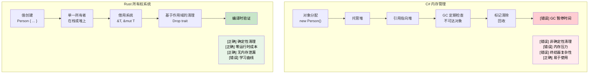

## 理解所有权

> **本章要点：** Rust 的所有权系统 — 为什么 `let s2 = s1` 会使 `s1` 失效（与 C# 的引用复制不同）、
> 三条所有权规则、`Copy` 与 `Move` 类型、使用 `&` 和 `&mut` 进行借用，
> 以及借用检查器如何取代垃圾回收。
>
> **难度：** 🟡 中级

所有权是 Rust 最独特的特性，也是 C# 开发者最大的概念转变。让我们逐步理解它。

### C# 内存模型（回顾）
```csharp
// C# - 自动内存管理
public void ProcessData()
{
    var data = new List<int> { 1, 2, 3, 4, 5 };
    ProcessList(data);
    // data 在此处仍然可访问
    Console.WriteLine(data.Count);  // 正常工作
    
    // 当没有引用指向它时，GC 会清理
}

public void ProcessList(List<int> list)
{
    list.Add(6);  // 修改原始列表
}
```

### Rust 所有权规则
1. **每个值只有一个所有者**（除非通过 `Rc<T>`/`Arc<T>` 选择共享所有权——见[智能指针](ch07-3-smart-pointers-beyond-single-ownership.md)）
2. **当所有者离开作用域时，值会被销毁**（确定性清理——见 [Drop](ch07-3-smart-pointers-beyond-single-ownership.md#drop-rusts-idisposable)）
3. **所有权可以被转移（移动）**

```rust
// Rust - 显式所有权管理
fn process_data() {
    let data = vec![1, 2, 3, 4, 5];  // data 拥有该向量
    process_list(data);              // 所有权转移给函数
    // println!("{:?}", data);       // ❌ 错误：data 在此处不再被拥有
}

fn process_list(mut list: Vec<i32>) {  // list 现在拥有该向量
    list.push(6);
    // list 在函数结束时被销毁
}
```

### 为 C# 开发者解释"移动"
```csharp
// C# - 复制引用，对象原地不动
// （仅适用于引用类型——类；
//  C# 中的值类型如 struct 行为不同）
var original = new List<int> { 1, 2, 3 };
var reference = original;  // 两个变量指向同一对象
original.Add(4);
Console.WriteLine(reference.Count);  // 4 - 同一对象
```

```rust
// Rust - 转移所有权
let original = vec![1, 2, 3];
let moved = original;       // 所有权被转移
// println!("{:?}", original);  // ❌ 错误：original 不再拥有数据
println!("{:?}", moved);    // ✅ 可以：moved 现在拥有数据
```

### Copy 类型与 Move 类型
```rust
// Copy 类型（类似 C# 值类型）- 被复制，而非移动
let x = 5;        // i32 实现了 Copy
let y = x;        // x 被复制给 y
println!("{}", x); // ✅ 可以：x 仍然有效

// Move 类型（类似 C# 引用类型）- 被移动，而非复制
let s1 = String::from("hello");  // String 没有实现 Copy
let s2 = s1;                     // s1 被移动给 s2
// println!("{}", s1);           // ❌ 错误：s1 不再有效
```

### 实际示例：交换值
```csharp
// C# - 简单的引用交换
public void SwapLists(ref List<int> a, ref List<int> b)
{
    var temp = a;
    a = b;
    b = temp;
}
```

```rust
// Rust - 感知所有权的交换
fn swap_vectors(a: &mut Vec<i32>, b: &mut Vec<i32>) {
    std::mem::swap(a, b);  // 内置的交换函数
}

// 或手动方式
fn manual_swap() {
    let mut a = vec![1, 2, 3];
    let mut b = vec![4, 5, 6];
    
    let temp = a;  // 将 a 移动到 temp
    a = b;         // 将 b 移动到 a
    b = temp;      // 将 temp 移动到 b
    
    println!("a: {:?}, b: {:?}", a, b);
}
```

***

## 借用基础

借用类似于 C# 中获取引用，但具有编译时安全保证。

### C# 引用参数
```csharp
// C# - ref 和 out 参数
public void ModifyValue(ref int value)
{
    value += 10;
}

public void ReadValue(in int value)  // 只读引用
{
    Console.WriteLine(value);
}

public bool TryParse(string input, out int result)
{
    return int.TryParse(input, out result);
}
```

### Rust 借用
```rust
// Rust - 使用 & 和 &mut 进行借用
fn modify_value(value: &mut i32) {  // 可变借用
    *value += 10;
}

fn read_value(value: &i32) {        // 不可变借用
    println!("{}", value);
}

fn main() {
    let mut x = 5;
    
    read_value(&x);      // 不可变借用
    modify_value(&mut x); // 可变借用
    
    println!("{}", x);   // x 在此处仍被拥有
}
```

### 借用规则（在编译时强制执行！）
```rust
fn borrowing_rules() {
    let mut data = vec![1, 2, 3];
    
    // 规则 1：可以同时存在多个不可变借用
    let r1 = &data;
    let r2 = &data;
    println!("{:?} {:?}", r1, r2);  // ✅ 可以
    
    // 规则 2：一次只能有一个可变借用
    let r3 = &mut data;
    // let r4 = &mut data;  // ❌ 错误：不能同时两次可变借用
    // let r5 = &data;      // ❌ 错误：可变借用期间不能不可变借用
    
    r3.push(4);  // 使用可变借用
    // r3 在此离开作用域
    
    // 规则 3：前一个借用结束后可以再次借用
    let r6 = &data;  // ✅ 现在可以
    println!("{:?}", r6);
}
```

### C# 与 Rust：引用安全性
```csharp
// C# - 潜在的运行时错误
public class ReferenceSafety
{
    private List<int> data = new List<int>();
    
    public List<int> GetData() => data;  // 返回对内部数据的引用
    
    public void UnsafeExample()
    {
        var reference = GetData();
        
        // 另一个线程可能在此修改 data！
        Thread.Sleep(1000);
        
        // reference 可能已无效或已改变
        reference.Add(42);  // 潜在的竞态条件
    }
}
```

```rust
// Rust - 编译时安全
pub struct SafeContainer {
    data: Vec<i32>,
}

impl SafeContainer {
    // 返回不可变借用 - 调用方不能修改
    // 优先使用 &[i32] 而非 &Vec<i32> — 接受最宽泛的类型
    pub fn get_data(&self) -> &[i32] {
        &self.data
    }
    
    // 返回可变借用 - 保证独占访问
    pub fn get_data_mut(&mut self) -> &mut Vec<i32> {
        &mut self.data
    }
}

fn safe_example() {
    let mut container = SafeContainer { data: vec![1, 2, 3] };
    
    let reference = container.get_data();
    // container.get_data_mut();  // ❌ 错误：不可变借用期间不能可变借用
    
    println!("{:?}", reference);  // 使用不可变引用
    // reference 在此离开作用域
    
    let mut_reference = container.get_data_mut();  // ✅ 现在可以
    mut_reference.push(4);
}
```

***

## 移动语义

### C# 值类型与引用类型
```csharp
// C# - 值类型被复制
struct Point
{
    public int X { get; set; }
    public int Y { get; set; }
}

var p1 = new Point { X = 1, Y = 2 };
var p2 = p1;  // 复制
p2.X = 10;
Console.WriteLine(p1.X);  // 仍然是 1

// C# - 引用类型共享同一对象
var list1 = new List<int> { 1, 2, 3 };
var list2 = list1;  // 引用复制
list2.Add(4);
Console.WriteLine(list1.Count);  // 4 - 同一对象
```

### Rust 移动语义
```rust
// Rust - 非 Copy 类型默认移动
#[derive(Debug)]
struct Point {
    x: i32,
    y: i32,
}

fn move_example() {
    let p1 = Point { x: 1, y: 2 };
    let p2 = p1;  // 移动（不是复制）
    // println!("{:?}", p1);  // ❌ 错误：p1 已被移动
    println!("{:?}", p2);    // ✅ 可以
}

// 要启用复制，实现 Copy trait
#[derive(Debug, Copy, Clone)]
struct CopyablePoint {
    x: i32,
    y: i32,
}

fn copy_example() {
    let p1 = CopyablePoint { x: 1, y: 2 };
    let p2 = p1;  // 复制（因为实现了 Copy）
    println!("{:?}", p1);  // ✅ 可以
    println!("{:?}", p2);  // ✅ 可以
}
```

### 何时会发生移动
```rust
fn demonstrate_moves() {
    let s = String::from("hello");
    
    // 1. 赋值时移动
    let s2 = s;  // s 移动到 s2
    
    // 2. 函数调用时移动
    take_ownership(s2);  // s2 移动进函数
    
    // 3. 从函数返回时移动
    let s3 = give_ownership();  // 返回值移动到 s3
    
    println!("{}", s3);  // s3 有效
}

fn take_ownership(s: String) {
    println!("{}", s);
    // s 在此被销毁
}

fn give_ownership() -> String {
    String::from("yours")  // 所有权转移给调用者
}
```

### 通过借用避免移动
```rust
fn demonstrate_borrowing() {
    let s = String::from("hello");
    
    // 借用而非移动
    let len = calculate_length(&s);  // s 被借用
    println!("'{}' has length {}", s, len);  // s 仍然有效
}

fn calculate_length(s: &String) -> usize {
    s.len()  // s 不被拥有，因此不会被销毁
}
```

***

## 内存管理：GC 与 RAII

### C# 垃圾回收
```csharp
// C# - 自动内存管理
public class Person
{
    public string Name { get; set; }
    public List<string> Hobbies { get; set; } = new List<string>();
    
    public void AddHobby(string hobby)
    {
        Hobbies.Add(hobby);  // 内存自动分配
    }
    
    // 无需显式清理 - GC 处理
    // 但资源需要 IDisposable 模式
}

using var file = new FileStream("data.txt", FileMode.Open);
// 'using' 确保 Dispose() 被调用
```

### Rust 所有权与 RAII
```rust
// Rust - 编译时内存管理
pub struct Person {
    name: String,
    hobbies: Vec<String>,
}

impl Person {
    pub fn add_hobby(&mut self, hobby: String) {
        self.hobbies.push(hobby);  // 内存管理在编译时跟踪
    }
    
        // Drop trait 自动实现 - 清理是有保证的
    // 与 C# 的 IDisposable 对比：
    //   C#:   using var file = new FileStream(...)    // Dispose() 在 using 块结束时调用
    //   Rust: let file = File::open(...)?             // drop() 在作用域结束时调用 — 无需 'using'
}

// RAII - 资源获取即初始化
{
    let file = std::fs::File::open("data.txt")?;
    // 当 'file' 离开作用域时，文件自动关闭
    // 无需 'using' 语句 - 由类型系统处理
}
```



***


<details>
<summary><strong>🏋️ 练习：修复借用检查器错误</strong>（点击展开）</summary>

**挑战**：以下每个代码片段都有一个借用检查器错误。在不改变输出的情况下修复它们。

```rust
// 1. 移动后使用
fn problem_1() {
    let name = String::from("Alice");
    let greeting = format!("Hello, {name}!");
    let upper = name.to_uppercase();  // 提示：借用而非移动
    println!("{greeting} — {upper}");
}

// 2. 可变借用与不可变借用重叠
fn problem_2() {
    let mut numbers = vec![1, 2, 3];
    let first = &numbers[0];
    numbers.push(4);            // 提示：重新排序操作
    println!("first = {first}");
}

// 3. 返回对局部变量的引用
fn problem_3() -> String {
    let s = String::from("hello");
    s   // 提示：返回拥有所有权的值，而非 &str
}
```

<details>
<summary>🔑 解答</summary>

```rust
// 1. format! 已经是借用的 — 修复方法是 format! 接受引用。
//    原始代码实际上可以编译！但如果有 `let greeting = name;`
//    则通过 &name 修复：
fn solution_1() {
    let name = String::from("Alice");
    let greeting = format!("Hello, {}!", &name); // 借用
    let upper = name.to_uppercase();             // name 仍然有效
    println!("{greeting} — {upper}");
}

// 2. 在可变操作之前使用不可变借用：
fn solution_2() {
    let mut numbers = vec![1, 2, 3];
    let first = numbers[0]; // 复制 i32 值（i32 实现了 Copy）
    numbers.push(4);
    println!("first = {first}");
}

// 3. 返回拥有所有权的 String（已经正确 — 这是初学者常见的困惑）：
fn solution_3() -> String {
    let s = String::from("hello");
    s // 所有权转移给调用者 — 这是正确的模式
}
```

**关键要点**：
- `format!()` 借用其参数 — 不会移动它们
- 像 `i32` 这样的基本类型实现了 `Copy`，因此索引访问会复制该值
- 返回拥有所有权的值会将所有权转移给调用者 — 无生命周期问题

</details>
</details>
